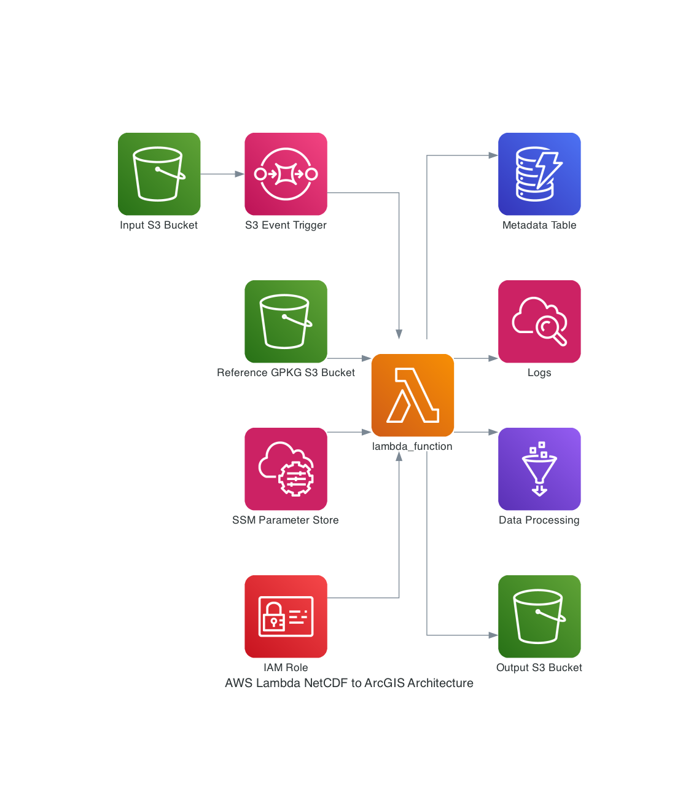

# AWS_NetCDF_2_ArcGIS_Online_Feature
ArcGIS API for Python script runs in AWS Lambda to convert NetCDF stations --> ArcGIS Online Hosted Feature Layer. I use this to run a process regularly which updates measurements that are delivered in NetCDF format.

# Lambda function 1

A Python-based lambda function that is used to ingest the contents from NetCDF files and write to ArcGIS Online, into a Hosted Feature Layer. 
As an intermediate storage, it uses an OGC-compatible Geopackage, the contents of which are then appended to the feature layer.

Because appending takes a while and can run asynchronously, the Append command is run by the Lambda function (and the Lambda function itself can then stop), but the Geopackage can't be deleted just yet.

Last step is to write the ID of the uploaded GPKG-file, which is quite big and could be expensive to keep in ArcGIS Online, into a CSV file on the S3 bucket, so the geopackage file item in ArcGIS Online can be identified and deleted in the next script run. (This way we only pay for hosting the item a couple of hours in ArcGIS Online).

CloudFormation:

Only if needed: A Cloudformation template is used to create the required infrastructure, including the Lambda function, networking components, S3 bucket, IAM Role and policy etc.

By running the CF template, it should be quicker and easier to deploy the many required components in AWS.

# Lambda function 2

A Python-based lambda function that is used to aggregate data which have been created in the first (Topnet) Lambda Function, and write to ArcGIS Online, into a Hosted Feature Layer.

As an intermediate storage, it uses an OGC-compatible Geopackage, the contents of which are then appended to the feature layer. Because appending takes a while and can run asynchronously, the Append command is run by the Lambda function (and the Lambda function itself can then stop), but the Geopackage can't be deleted just yet.

Last step is to write the ID of the uploaded GPKG-file, which is quite big and could be expensive to keep in ArcGIS Online, into a CSV file on the S3 bucket, so the geopackage file item in ArcGIS Online can be identified and deleted in the next script run. (This way we only pay for hosting the item a couple of hours in ArcGIS Online).

Terraform (lambda_function2.tf):

Only if needed: A Terraform template is used to create the required infrastructure, including the Lambda function, and associate it with IAM Role and policy, Lambda Layer etc. etc.

By running the Terraform template, it should be quicker and easier to deploy the many required components in AWS. Variables can be used with the template to create different versions of this Lambda Function.

# Lambda layer creation

The Lambda function uses libraries which altogether would make the Lambda function quite unwieldy and slower to start after a cold start, so a lambda layer has been created separately which contains libraries from the requirements.txt file (e.g. SQLalchemy and NetCDF4).

This can be found in a separate repo: https://github.com/bird70/AWS_ArcGIS_Lambda_Layer

If the Lambda layer is not suitable for your use case, follow the instructions below to create your own version of, using Docker (there's a file size limit for the Lamba layer which must be < ca. 230 MB. In my case, with a zip of the Docker output, a zip-file size < ca. 89 MB was okay, with larger files, a lambda layer couldn't be created in AWS. That was the reason why some arcgis functionality is _not_ part of this Lambda layer - e.g. Deep Learning).

Use Docker build to create a Linux environment which all requirements get added to (Rather than using the Docker command line, I have used Visual Studio Code with the Docker addin to do this):

docker build -t lambda-layer-builder .

Run the new container and log in to Bash shell (within Visual Studio code with Docker extension installed):

docker run -it --name lambda-layer-container_amazon2023 lambda-layer-builder /bin/bash

Export resulting package and use for the creation of a Lambda layer:

--> navigate to files in the running container and click "Download" on the "/lambda-layer/lambda-layer_py311_AmazonLinux2023_3.zip" file.

Use AWS console to create a new layer, using this zip file (if it's > 50 MB, we have to upload it to S3 first and use the file from there.)

Associate the lambda layer with the Lambda function (this can be done in the AWS conso;le).

Create EventNotification on the bucket that is triggered on Object Create etc.

Make sure IAM permissions/policy allow the function access the respective S3 bucket.
